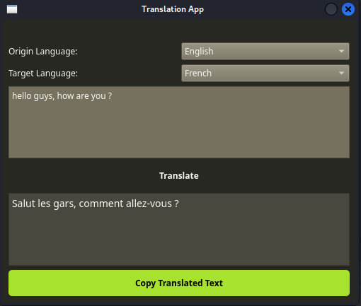

# Translation App



Translation App is a simple desktop application that allows users to translate text from one language to another. It uses the Google Translate API for translation. The user can input text in the source language, choose the origin and target languages from a dropdown menu, and then click the "Translate" button to get the translated text. Additionally, users can copy the translated text to the clipboard using the "Copy Translated Text" button.

## Table of Contents
- [Features](#features)
- [Installation](#installation)
- [Usage](#usage)
- [Dependencies](#dependencies)
- [Contributing](#contributing)
- [License](#license)

## Features

- Translate text from various languages to different target languages.
- Choose the origin and target languages from a selection of popular languages.
- Copy translated text to the clipboard with one click.
- Easy-to-use and intuitive user interface.

## Installation

1. Clone the repository to your local machine:

```bash
git clone https://github.com/djefferson-saintilus/translationapp.git
```

2. Install the required dependencies:

```bash
pip install PyQt6 googletrans==4.0.0-rc1
```

## Usage

1. Run the `translationapp.py` script:

```bash
python translationapp.py
```

2. The Translation App window will open. You can see the logo at the top and two dropdown menus to select the origin and target languages. Enter the text you want to translate in the "Enter text to translate..." field.

3. Choose the origin and target languages from the dropdown menus.

4. Click the "Translate" button to get the translated text displayed in the lower text area.

5. To copy the translated text to the clipboard, click the "Copy Translated Text" button.

## Dependencies

The Translation App requires the following dependencies:

- PyQt6
- googletrans==4.0.0-rc1

## Contributing

Contributions to the project are welcome! If you find any issues or want to add new features, feel free to open an issue or submit a pull request. Make sure to follow the existing coding style and provide clear commit messages.

## License

This project is licensed under the MIT License - see the [LICENSE](LICENSE) file for details.